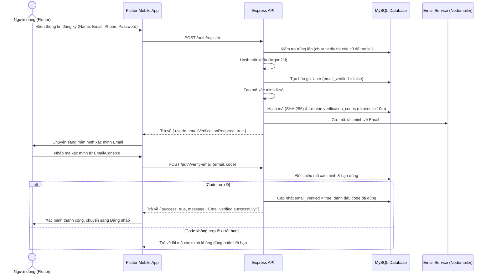
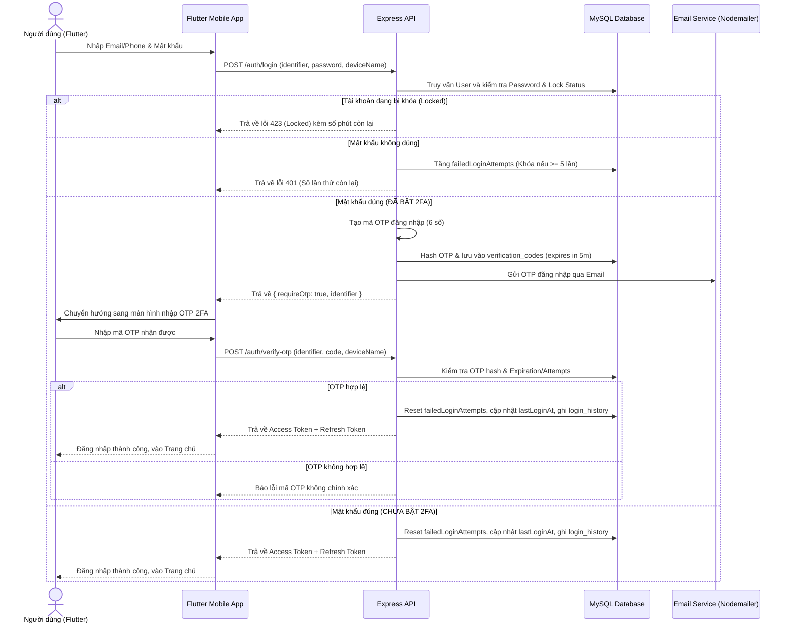

# Hướng dẫn Bảo mật Tài khoản (Account Security Guide)

Dự án **Movie Ticket Booking App with Account Security** tích hợp một hệ thống bảo mật tài khoản chuẩn công nghiệp, bảo vệ thông tin người dùng từ giai đoạn đăng ký cho tới quá trình đăng nhập và quản lý thiết bị. Tài liệu này hướng dẫn chi tiết các tính năng bảo mật, sơ đồ luồng dữ liệu và các bước thực hành demo trên lớp.

---

## 1. Các vấn đề về bảo mật tài khoản của hệ thống

Hệ thống giải quyết các mối đe dọa phổ biến về bảo mật tài khoản thông qua các cơ chế sau:

### 1.1. Mã hóa mật khẩu an toàn (Argon2id)
*   **Vấn đề**: Rò rỉ cơ sở dữ liệu (Database Leak) có thể làm lộ mật khẩu dạng plain-text của người dùng nếu mã hóa yếu (như MD5, SHA-1).
*   **Giải pháp**: Sử dụng thư viện **Argon2id** để băm (hash) mật khẩu trước khi lưu vào cột `password_hash` của bảng `users`. Argon2id là thuật toán thắng giải password hashing competition, chống tấn công brute-force hiệu quả trên cả CPU, GPU và phần cứng chuyên dụng ASIC.
*   **Quy tắc**: Tuyệt đối không lưu mật khẩu thô và không ghi log mật khẩu của người dùng.

### 1.2. Khóa tài khoản tạm thời (Account Lockout)
*   **Vấn đề**: Tấn công dò mật khẩu (Brute-force/Credential Stuffing).
*   **Giải pháp**: Khi người dùng nhập sai mật khẩu liên tiếp:
    *   Hệ thống tăng trường `failed_login_attempts` trong bảng `users`.
    *   Khi chạm ngưỡng tối đa **5 lần thất bại** (cấu hình trong `config.security.maxFailedAttempts`), tài khoản sẽ tự động khóa trong **5 phút** (`locked_until`).
    *   Trong thời gian khóa, mọi nỗ lực đăng nhập tiếp theo đều bị từ chối ngay lập tức kèm theo thông báo thời gian chờ còn lại mà không cần kiểm tra mật khẩu.
    *   Đồng thời, một cảnh báo bảo mật (`ACCOUNT_LOCKED`) có mức độ nghiêm trọng **HIGH** được tạo ra để ghi nhận sự kiện này.

### 1.3. Lịch sử đăng nhập & Thiết bị đáng ngờ
*   **Vấn đề**: Người dùng bị kẻ xấu đăng nhập trái phép từ xa.
*   **Giải pháp**: 
    *   Mỗi lượt đăng nhập (thành công hay thất bại) đều được lưu vào bảng `login_history` bao gồm: Địa chỉ IP (`ip_address`), User-Agent (`user_agent`), Tên thiết bị (`device_name`), và trạng thái thành công (`success`).
    *   Hệ thống tự động đối chiếu `device_name` hiện tại với danh sách các thiết bị đã từng đăng nhập thành công trước đây. Nếu phát hiện thiết bị mới, thuộc tính `suspicious` sẽ được đánh dấu là `true`, tạo sự kiện cảnh báo thiết bị lạ (`SUSPICIOUS_LOGIN`) và gửi email thông báo tới người dùng.

### 1.4. Đánh giá điểm bảo mật (Security Score)
*   **Vấn đề**: Người dùng không ý thức được tài khoản của mình an toàn ở mức độ nào.
*   **Giải pháp**: Hệ thống tự động tính toán điểm bảo mật theo thời gian thực (từ 0 - 100) trên trang **Security Dashboard**:
    *   Điểm mặc định: **100**
    *   Chưa xác minh Email: **-30 điểm**
    *   Chưa xác minh Số điện thoại: **-25 điểm**
    *   Chưa cập nhật Số điện thoại: **-15 điểm**
    *   Chưa bật xác thực 2 lớp (2FA): **-20 điểm**
    *   Đang có đăng nhập thiết bị lạ: **-15 điểm**
    *   Số lần đăng nhập sai nhiều (>3 lần): **-15 điểm**
    *   Tài khoản đang bị khóa: **-20 điểm**

---

## 2. Bảo mật qua Email

Email đóng vai trò là kênh xác minh danh tính và khôi phục tài khoản chính của hệ thống.



### Các quy tắc bảo mật Email:
1.  **Xác minh bắt buộc**: Tài khoản mới đăng ký phải xác minh email trước khi đăng nhập.
2.  **Mã hóa mã OTP/Verify**: Hệ thống chỉ lưu trữ chuỗi hash SHA-256 của mã xác minh (`code_hash`) trong bảng `verification_codes` chứ không lưu mã gốc.
3.  **Giới hạn hạn dùng**: Mã xác minh email có hiệu lực trong **10 phút**.
4.  **Giới hạn số lần nhập sai**: Tối đa **5 lần thử** cho một mã xác minh. Vượt quá 5 lần, mã bị vô hiệu hóa để chặn tấn công brute-force trực tiếp vào mã OTP.
5.  **Cơ chế chống Spam (Resend Cooldown)**: Nút gửi lại mã xác minh trên Flutter có thời gian chờ (cooldown) là **60 giây** để tránh làm nghẽn dịch vụ gửi thư (SMTP).

---

## 3. Bảo mật bằng mã OTP (2FA)

Xác thực hai yếu tố (Two-Factor Authentication - 2FA) thông qua mã OTP qua Email cung cấp thêm lớp bảo vệ ngay cả khi mật khẩu của người dùng bị lộ.



### Các quy tắc bảo mật OTP:
1.  **Điều kiện kích hoạt**: Người dùng chỉ được phép bật 2FA khi Email hoặc Số điện thoại đã được xác minh thành công.
2.  **Thời gian sống cực ngắn (TTL)**: Mã OTP đăng nhập chỉ tồn tại trong **5 phút**.
3.  **Tự động vô hiệu hóa**: 
    *   Mã OTP sẽ tự động đánh dấu là đã dùng (`used = true`) ngay khi xác minh thành công.
    *   Mọi mã OTP cũ chưa dùng của tài khoản đó sẽ bị hủy khi có yêu cầu sinh mã OTP mới.
4.  **Chống Brute-force OTP**: Người dùng chỉ có tối đa **5 lần nhập sai OTP**. Nếu nhập sai quá 5 lần, bản ghi OTP đó sẽ bị thu hồi và hệ thống ghi nhận cảnh báo tấn công dò mã (`OTP_BRUTE_FORCE`).

---

## 4. Hướng dẫn Demo trên lớp (Demo Walkthrough)

Dưới đây là các bước thực tế để chạy thử và thuyết trình tính năng bảo mật tài khoản cho giảng viên:

### Bước 1: Khởi động hệ thống
1. Khởi động MySQL thông qua Docker Compose:
   ```bash
   docker-compose up -d
   ```
2. Cài đặt dependency & Khởi chạy Backend Node.js:
   ```bash
   cd backend
   npm install
   npm run dev
   ```
3. Chạy Flutter app trên máy ảo Android hoặc thiết bị thật:
   ```bash
   cd flutter_app
   flutter run
   ```

### Bước 2: Đăng ký & Xác minh Email
1. Trên giao diện Flutter, chọn **Đăng ký** (Register).
2. Điền thông tin:
   * **Họ tên**: Nguyễn Văn A
   * **Email**: `vana@example.com`
   * **Mật khẩu**: `SecurePassword@123` (yêu cầu ít nhất 8 ký tự, 1 hoa, 1 thường, 1 số, 1 ký tự đặc biệt).
3. Sau khi nhấn Đăng ký, màn hình nhập mã xác minh sẽ xuất hiện.
4. Mở cửa sổ **Console của Backend** để tìm mã xác minh được in ra dưới dạng:
   ```text
   🔑 VERIFICATION CODE for vana@example.com: XXXXXX
   ```
5. Nhập mã `XXXXXX` vào app Flutter để hoàn thành xác minh.

### Bước 3: Đăng nhập & Xem Dashboard Bảo mật
1. Đăng nhập bằng email `vana@example.com` và mật khẩu `SecurePassword@123`.
2. Vào tab **Security** (Bảo mật) hoặc mục bảo mật trong Hồ sơ.
3. Quan sát **Security Dashboard**:
   * **Điểm bảo mật**: Sẽ thấp (khoảng 80 điểm) vì chưa kích hoạt 2FA.
   * **Vấn đề bảo mật**: Hiện dòng chữ cảnh báo màu vàng "Two-factor authentication disabled".
   * **Lịch sử đăng nhập**: Ghi nhận một thiết bị vừa đăng nhập thành công.

### Bước 4: Kích hoạt Xác thực 2 lớp (2FA)
1. Trên màn hình Security, nhấn nút bật **Two-Factor Authentication (2FA)**.
2. Hệ thống sẽ cập nhật trạng thái bật 2FA thành công và ghi nhận một cảnh báo cấp độ thấp thông báo 2FA đã bật.
3. Quan sát **Điểm bảo mật**: Điểm số sẽ tăng lên gần tối đa (100 điểm) và cảnh báo màu vàng biến mất.

### Bước 5: Đăng xuất & Đăng nhập với OTP
1. Chuyển sang tab **Profile** và nhấn **Đăng xuất** (Logout).
2. Quay lại màn hình đăng nhập, nhập Email và Mật khẩu.
3. Thay vì vào thẳng trang chủ, ứng dụng chuyển sang màn hình **Xác thực OTP**.
4. Vào **Console của Backend** để lấy mã OTP vừa sinh ra:
   ```text
   🔐 OTP CODE for vana@example.com: YYYYYY
   ```
5. Nhập mã `YYYYYY` vào ứng dụng để hoàn thành đăng nhập thành công.

### Bước 6: Demo tính năng Khóa tài khoản (Account Lockout)
1. Đăng xuất tài khoản.
2. Tiến hành đăng nhập lại nhưng cố tình nhập **sai mật khẩu liên tục 5 lần**.
3. Tại lần thứ 5, ứng dụng sẽ hiển thị thông báo lỗi:
   ```text
   Tài khoản đã bị khóa. Vui lòng thử lại sau 5 phút.
   ```
4. Thử đăng nhập lại bằng mật khẩu **đúng**, hệ thống vẫn từ chối và báo tài khoản đang bị khóa.
5. Kiểm tra email cảnh báo (hoặc log gửi mail) để thấy email cảnh báo khóa tài khoản đã được kích hoạt.
