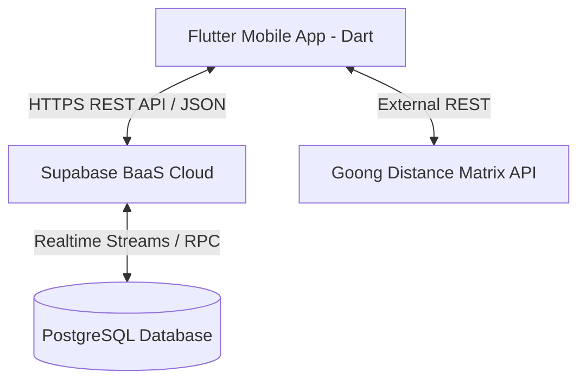

# BÁO CÁO TỔNG QUAN DỰ ÁN (PROJECT OVERVIEW PROFILE)
## Movie Ticket Booking App with Account Security

Tài liệu này cung cấp cái nhìn tổng quan kỹ thuật, kiến trúc hệ thống, danh sách tính năng và thư viện cốt lõi của ứng dụng đặt vé xem phim tích hợp bảo mật tài khoản di động (môn học PRM).

---

### 1. THÔNG TIN CHUNG
* **Tên dự án:** Movie Ticket Booking App with Account Security
* **Mục tiêu cốt lõi:** Xây dựng một ứng dụng di động đặt vé xem phim trực quan và mượt mà trên nền tảng Flutter, tích hợp các cơ chế bảo mật tài khoản nâng cao như giám sát phiên đăng nhập, lịch sử truy cập thiết bị và xác thực nâng cao, đồng thời tối ưu hóa trải nghiệm người dùng cuối qua dịch vụ định vị GPS (Goong API) và tương tác sơ đồ ghế thông minh.

---

### 2. VAI TRÒ TRONG HỆ THỐNG (USER ROLES & ACTORS)

| Vai trò | Mô tả đối tượng | Đặc quyền & Tính năng khả dụng |
| :--- | :--- | :--- |
| **Thành viên (Khách hàng)** | Người dùng đăng ký tài khoản hợp lệ | <ul><li>Đăng ký, Đăng nhập an toàn & lưu trữ mã hóa phiên đăng nhập bằng Secure Storage.</li><li>**Security Dashboard:** Xem nhật ký đăng nhập (IP, thiết bị, thời gian), thu hồi/đăng xuất phiên làm việc từ xa của thiết bị lạ.</li><li>Tra cứu danh sách phim Đang chiếu / Sắp chiếu, xem trailer và thông tin chi tiết.</li><li>Định vị vị trí hiện tại và tính toán khoảng cách thực tế đến các rạp (Goong API).</li><li>**Đặt vé xem phim:** Chọn suất chiếu, thao tác sơ đồ ghế InteractiveViewer, chọn combo bắp nước, áp mã khuyến mãi.</li><li>**Thanh toán SeaPay:** Thực hiện giao dịch giả lập qua cổng thanh toán, cập nhật trạng thái đơn đặt vé tức thì.</li><li>**Vé cá nhân:** Xem lịch sử đặt vé, mở vé răng cưa CustomPainter tích hợp tự tăng độ sáng màn hình và quét mã QR.</li></ul> |
| **Quản trị viên (Admin)** | Tài khoản quản trị cấp cao | <ul><li>Đăng nhập vào bảng điều khiển (Admin Dashboard).</li><li>Xem thống kê doanh thu thực tế, tổng số vé đã bán và số lượng phim hoạt động.</li><li>Quản lý danh sách phim (Thêm phim mới, cập nhật mô tả, chuyển đổi trạng thái COMING_SOON / NOW_SHOWING).</li><li>Tự động tạo lịch chiếu cho rạp trống bằng cách kích hoạt Database RPC `generate_showtimes_for_next_days`.</li></ul> |

---

### 3. NGÔN NGỮ LẬP TRÌNH & CÔNG NGHỆ



* **Frontend (Mobile App):**
  * Ngôn ngữ: **Dart (Flutter SDK)**.
  * Thiết kế UI/UX: **Material 3 Design Guidelines** với thiết kế Dark Theme cao cấp, độ tương phản cao, hỗ trợ người mù màu tại sơ đồ ghế.
* **Backend & Cloud (BaaS):**
  * Nền tảng: **Supabase Cloud**.
  * Chức năng tích hợp: Xác thực người dùng (Supabase Auth), Lưu trữ hình ảnh poster (Supabase Storage), Lắng nghe trạng thái giữ ghế (Supabase Realtime).
* **Cơ sở dữ liệu (Database):**
  * Hệ quản trị: **PostgreSQL** chạy trên nền tảng Supabase Cloud.
  * Tương tác dữ liệu: Kết nối trực tiếp qua SDK Client của Supabase và thực thi giao dịch qua Stored Procedures (RPCs).

---

### 4. CƠ SỞ DỮ LIỆU (DATABASE SYSTEM)

Cơ sở dữ liệu của hệ thống được di cư và đồng bộ thông qua các tệp script SQL định nghĩa cấu trúc bảng dưới đây:

#### Các bảng thực thể chính
1. **`movies`**: Lưu trữ thông tin phim (id, title, synopsis, director, actors, duration, poster_url, trailer_url, status: `NOW_SHOWING` / `COMING_SOON`).
2. **`cinemas`**: Danh sách rạp chiếu phim (id, name, address, latitude, longitude).
3. **`rooms`**: Phòng chiếu trực thuộc rạp (id, name, cinema_id, total_rows, total_columns).
4. **`seats`**: Danh sách ghế ngồi trong phòng (id, room_id, row, col, type: `STANDARD` / `VIP` / `COUPLE`, position_x, position_y).
5. **`showtimes`**: Lịch chiếu phim (id, movie_id, room_id, start_time, end_time, price).
6. **`bookings`**: Đơn đặt vé (id, user_id, showtime_id, total_amount, status: `PENDING` / `PAID` / `CANCELLED`, payment_method, created_at).
7. **`booking_seats`**: Bảng trung gian lưu vết danh sách ghế được chọn cho mỗi đơn đặt (booking_id, seat_id).
8. **`seat_holds`**: Lưu giữ tạm thời ghế người dùng đang chọn trong vòng 10 phút để tránh xung đột đặt trùng (id, showtime_id, seat_id, user_id, created_at).
9. **`tickets`**: Vé xem phim chính thức (id, booking_id, ticket_code, qr_code_url, created_at).
10. **`promotions`**: Mã giảm giá khuyến mãi (id, code, discount_percent, max_discount, min_purchase, usage_limit, usage_count, start_date, end_date, active).
11. **`login_history`**: Nhật ký bảo mật đăng nhập (id, user_id, ip_address, user_agent, device_info, logged_in_at).
12. **`order_items`**: Chi tiết sản phẩm bắp nước mua kèm trong đơn đặt vé (id, booking_id, product_id, combo_id, quantity, unit_price).

#### Các hàm thủ tục lưu trữ (Database RPCs) nâng cao
* `create_booking`: Transaction bảo mật dùng để tạo đơn đặt vé, tự kiểm tra ghế trống, chốt giao dịch và giảm số lượt mã khuyến mãi đồng thời để tránh race condition.
* `confirm_booking_payment`: Chuyển trạng thái đơn vé sang `PAID`, sinh mã vé QR code ngẫu nhiên và giải phóng ghế khỏi bảng giữ tạm thời `seat_holds`.
* `generate_showtimes_for_next_days`: Tự động tính toán và sinh lịch chiếu phim cho rạp trống trong 3 ngày kế tiếp.

---

### 5. DANH SÁCH THƯ VIỆN CỐT LÕI (CORE DEPENDENCIES)

Dưới đây là các thư viện chính khai báo trong `pubspec.yaml` phục vụ cho các cấu phần kỹ thuật của ứng dụng di động:

| Tên thư viện | Phiên bản | Mục đích sử dụng trong dự án |
| :--- | :--- | :--- |
| `supabase_flutter` | `^2.8.0` | SDK chính kết nối với Supabase BaaS (Auth, Database, Realtime). |
| `geolocator` | `^12.0.0` | Truy vấn tọa độ GPS hiện tại của thiết bị người dùng. |
| `http` | `^1.2.1` | Thực hiện các yêu cầu HTTP bên ngoài để gọi dịch vụ bản đồ Goong API. |
| `screen_brightness` | `^2.1.9` | UX tối ưu: Tự động điều khiển tăng max 100% độ sáng màn hình khi xem vé QR. |
| `qr_flutter` | `^4.1.0` | Kết xuất mã QR tĩnh/động cho thông tin mã vé đã mua. |
| `cached_network_image` | `^3.4.1` | Caching hình ảnh poster phim lưu ở bộ nhớ tạm giúp tải trang mượt mà. |
| `google_fonts` | `^6.2.1` | Cung cấp kiểu chữ Outfit, Space Grotesk và Roboto Mono cao cấp. |
| `intl` | `^0.19.0` | Định dạng tiền tệ VNĐ và múi giờ hiển thị ngày chiếu tại Việt Nam. |

---

### 6. BẢN ĐỒ TÍNH NĂNG & CHỨC NĂNG (FEATURE MAP)

```
📦 6 MODULE CỐT LÕI
├── 1. AUTH (Xác thực)
│   ├── Đăng ký tài khoản (Họ tên, Email, Mật khẩu)
│   ├── Đăng nhập an toàn & Ghi nhớ phiên làm việc
│   └── Đăng xuất, xóa token truy cập khỏi thiết bị
│
├── 2. MOVIES (Phim)
│   ├── Xem danh sách phim Đang chiếu (NOW_SHOWING) và Sắp chiếu (COMING_SOON)
│   ├── Chi tiết phim: Tóm tắt nội dung, Đạo diễn, Diễn viên, Trailer Youtube
│   └── Định vị vị trí hiện tại, quét rạp chiếu phim gần nhất & hiển thị khoảng cách di chuyển thực tế (Goong API)
│
├── 3. BOOKING (Đặt vé)
│   ├── Chọn suất chiếu động gom nhóm theo Rạp và Ngày chiếu
│   ├── Bản đồ ghế thu phóng mượt mà (InteractiveViewer) phân biệt loại ghế (Thường, VIP, Couple)
│   ├── Inclusive Design: Hỗ trợ ký hiệu riêng cho người mù màu nhận diện ghế
│   ├── Thực hiện giữ ghế Realtime tránh trùng lặp chỗ ngồi
│   ├── Chọn sản phẩm đi kèm (Bắp nước, Combo)
│   ├── Áp dụng mã giảm giá khuyến mãi (Promotions) hợp lệ
│   └── Tích hợp thanh toán mô phỏng cổng SeaPay chuyển trạng thái tức thì
│
├── 4. PROFILE (Cá nhân)
│   ├── Xem thông tin người dùng hiện tại
│   └── Xem lịch sử đặt vé chi tiết (vé đã thanh toán, vé đã hủy)
│
├── 5. SECURITY (Bảo mật tài khoản)
│   ├── Bảng điều khiển bảo mật (Security Dashboard)
│   ├── Liệt kê chi tiết nhật ký đăng nhập (Thời gian, IP Address, OS, Thiết bị sử dụng)
│   └── Đăng xuất từ xa / Hủy phiên đăng nhập (Revoke Session) của thiết bị đáng ngờ
│
└── 6. ADMIN (Quản trị)
    ├── Thống kê tổng doanh thu thực tế, số vé đã bán và số lượng phim đang hoạt động
    ├── Quản lý danh sách phim (Thêm phim mới, sửa đổi trạng thái phim)
    └── Kích hoạt DB RPC tự động sinh lịch chiếu nhanh cho các phòng trống
```
